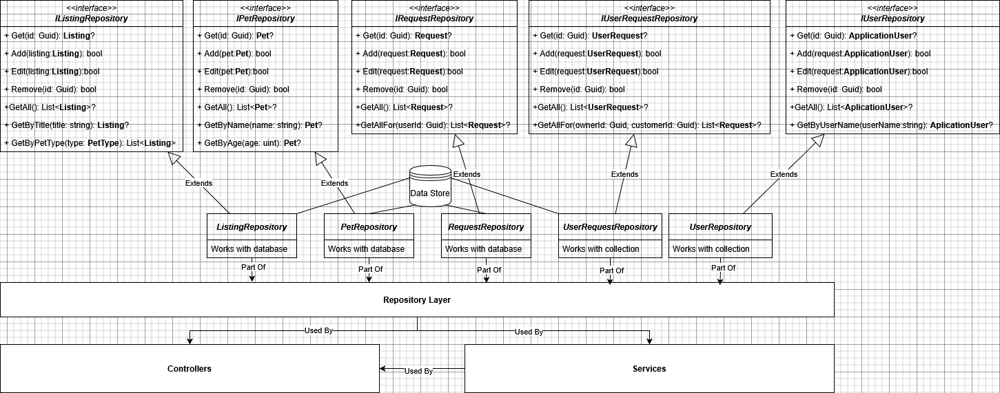
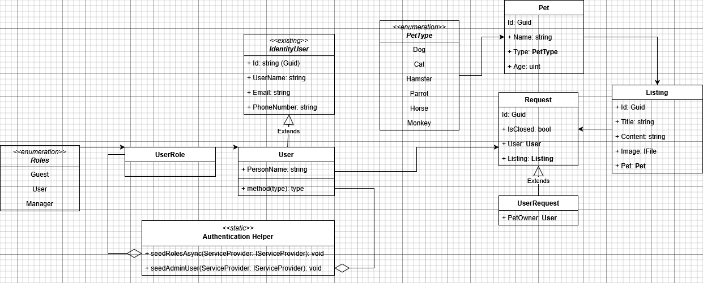

# CozyHouse Web Application

CozyHouse is a web application designed to connect animal shelters and individuals who wish to adopt pets in need of a home. This platform allows animal shelter owners to conveniently publish profiles of animals available for adoption, while also enabling users to submit their information to adopt an animal. 

Additionally, the application allows regular users to post profiles of stray animals that need a home, contributing to the solution of the stray animal problem.

## Features
- **Managers** can create and manage animal profiles that are available for adoption. Can delete User accounts. Can close requests for adoption.
- **Users** can browse available animal profiles and submit adoption requests. User can also post profiles of animals needing a home.
- **Guest** can browse available animal profiles.
  
## Use Case Diagram

## Data Access

## Identity & Entities

## Downloadable Resources
- [Table](Assets/CozyHouse_Table_English_V2.xlsx)
