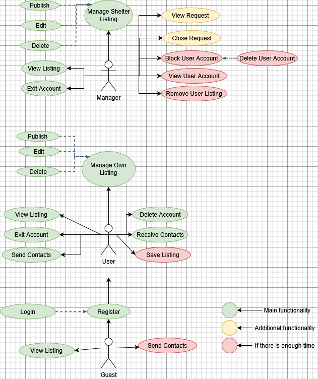

# CozyHouse Web Application

CozyHouse is a web application designed to connect animal shelters and individuals who wish to adopt pets in need of a home. This platform allows animal shelter owners to conveniently publish profiles of animals available for adoption, while also enabling users to submit their information to adopt an animal. 

Additionally, the application provides an opportunity for regular users to post profiles of stray animals that need a home, contributing to the solution of the stray animal problem.

## Features
- **Animal Shelter Owners** can create and manage profiles for animals available for adoption.
- **Users** can browse available animal profiles and submit adoption requests.
- **Public users** can also post profiles of animals needing a home.
  
## Use Case Diagram

## Downloadable Resources
- [Table](Assets/CozyHouse_Table_English_V2.xlsx)
